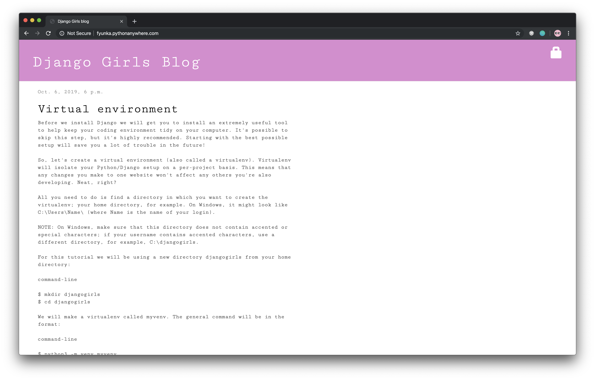

# DjangoGirls Workshop Blog

Based on 🦄 [Django Girls Tutorial](https://tutorial.djangogirls.org/en/) available online on different languages.

   

## Demo

### Check out Django Girls Blog [demo website](http://fyunka.pythonanywhere.com/)

## Learn More

Tutorial extensions (add more functionality to your website, secure your website, create comment model, PostgreSQL installation (optional) and Deploy on Heroku) [Django Girls Tutorial Extensions](https://tutorial-extensions.djangogirls.org/en/authentication_authorization/).

Check out Django documentation for any further reference [Django documentation](https://docs.djangoproject.com/en/2.2/).

